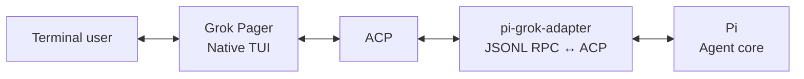
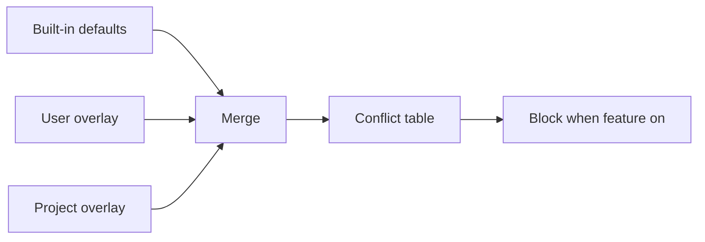

# grok-pi — Remote TUI bridge for Pi and Grok Build

> Pi agent core in Grok Build's native terminal UI.

[Download latest release](https://github.com/Dwsy/grok-pi/releases/latest) · [ZH](README.zh-CN.md) · [Feature matrix](FEATURE_MATRIX.md) · [Architecture](NATIVE_GROK_TUI_ALIGNMENT.md) · [Verification](VERIFICATION.md) · [Changelog](CHANGELOG.MD)

> **Remote TUI bridge.** Pi's interactive components render through Grok Build's native Pager, preserving the Grok terminal experience while exposing Pi's extension ecosystem. Pi users get Grok Build's native UI; Grok Build users get Pi's models, tools, sessions, and extensions.

`grok-pi` combines Pi's agent runtime with Grok Build's native Pager. Pi remains responsible for models, tools, extensions, sessions, and agent execution. Grok Pager remains the only terminal UI.

## Install

### macOS / Linux

```bash
curl -fsSL https://github.com/Dwsy/grok-pi/releases/latest/download/install.sh | sh
```

### Windows

```powershell
irm https://github.com/Dwsy/grok-pi/releases/latest/download/install.ps1 | iex
```

The installer picks the matching release asset and installs `grok-pi`:

| Platform | Asset |
|---|---|
| macOS Apple Silicon | `grok-pi-macos-aarch64.tar.gz` |
| macOS Intel | `grok-pi-macos-x86_64.tar.gz` |
| Linux x86_64 | `grok-pi-linux-x86_64.tar.gz` |
| Linux ARM64 | `grok-pi-linux-aarch64.tar.gz` |
| Windows x64 | `grok-pi-windows-x86_64.zip` |
| Windows ARM64 | `grok-pi-windows-aarch64.zip` |

Defaults: Unix → `~/.local/bin`; Windows → `%LOCALAPPDATA%\grok-pi\bin`. Override with `GROK_PI_INSTALL_DIR`. Pin with `GROK_PI_VERSION=vX.Y.Z`.

Unix also creates a `pi-grok` symlink (Windows: `pi-grok.exe` hardlink/copy):

```bash
grok-pi --help   # original name
pi-grok --help   # alias
```

`grok-pi` requires [Pi](https://pi.dev) **0.80.10 or newer** (system `pi` / pi.dev installer):

```bash
# recommended
curl -fsSL https://pi.dev/install.sh | sh
# Windows:
# powershell -c "irm https://pi.dev/install.ps1 | iex"
# or npm:
npm install --global @earendil-works/pi-coding-agent
```

On Windows, if an older `grok-pi.exe` cannot find bare `pi`, point it at the shim:

```powershell
$env:PI_BIN = "$env:LOCALAPPDATA\pi-node\current\pi.cmd"
grok-pi --pi-bin $env:PI_BIN
```

## Start

From any project directory:

```bash
grok-pi
# or
pi-grok
```

Defaults: system `pi` on PATH, current working directory as the project. Continue the previous session with `grok-pi --continue`.

Useful commands:

```bash
grok-pi --help
grok-pi update --check
grok-pi update
```

## What it provides

| Area | Included |
|---|---|
| Agent runtime | Pi models, providers, tools, extensions, skills, sessions, retries, and compaction |
| Terminal UI | Grok Pager input, slash completion, Markdown, tool cards, diffs, dialogs, and scrollback |
| **Remote TUI bridge** | Pi `ctx.ui.custom` components rendered through Grok Build's native Pager, without a second TUI |
| Shell execution | Bash integration, background tasks, output limits, timeouts, and process-tree cleanup |
| Parallel work | Pi sub-agents with foreground/background execution and native task views |
| Rhai workflows | Upstream `xai-workflow` host (F2 **Pi workflows**); `/workflow`, `/workflows`, `/create-workflow`; scripts under `~/.grok-pi/workflows` and `<repo>/.grok-pi/workflows` |
| Session workflow | Resume, tree navigation, labels, recap, context inspection, and session picker |
| Resource management | Native manager for Pi extensions, skills, prompts, and themes |
| Updates | GitHub Releases-based update check and installation |

For field-level behavior and intentional omissions, see the [feature matrix](FEATURE_MATRIX.md).

## Architecture



The integration has three boundaries:

- **Grok Pager** owns terminal lifecycle, input, rendering, dialogs, and visible UI.
- **Pi** owns the agent loop, models, providers, tools, extensions, and sessions.
- **`pi-grok-adapter`** is a headless JSONL RPC ↔ ACP bridge. It does not own a terminal or render a second UI.

Pi source is not modified. The Remote TUI bridge connects capabilities unavailable in Pi RPC through the official extension API and projects them onto native Pager surfaces.

## Configuration

Bundled bridge extensions are enabled by default where stable. Experimental native commands are opt-in.

| Variable | Default | Purpose |
|---|---:|---|
| `PI_GROK_REMOTE_TUI` | `1` | Enable Pi `ctx.ui.custom` components |
| `PI_GROK_BASH` | `1` | Enable Grok-owned Bash integration |
| `PI_GROK_NATIVE_COMMANDS` | `0` | Enable experimental `/pi-*` commands |
| `GROK_HOME` | `~/.grok-pi` | User state root (isolated from stock Grok `~/.grok`) |
| `GROK_PROJECT_DIR` | `.grok-pi` | Project config/workflows/hooks dir name under repo root |
| `GROK_PI_NO_AUTO_UPDATE` | unset | Disable background update checks |

Rhai workflows are **off by default** (F2 → Agent → **Pi workflows**, then full restart). Details: [FEATURE_MATRIX.md](FEATURE_MATRIX.md), [AGENTS.md](AGENTS.md#product-state-isolation).

Use `--no-extensions` to disable bundled bridge extensions. Pi startup options can be passed directly after `--`.

```bash
grok-pi -- --model openai/gpt-4o
```

## Build from source

Requirements: Rust **1.92.0**, Node.js **22.19.0 or newer**, npm, and a system Pi installation.

```bash
./build.sh
./target/debug/grok-pi
# or: PI_BIN=pi ./run-local.sh
```

Run verification with:

```bash
./verify.sh
```

See [VERIFICATION.md](VERIFICATION.md) for the distinction between static checks and runtime acceptance.

## Documentation

- [Feature matrix](FEATURE_MATRIX.md) — supported behavior and intentional boundaries
- [Architecture alignment](NATIVE_GROK_TUI_ALIGNMENT.md) — component ownership, protocol mapping, and migration guidance
- [Verification record](VERIFICATION.md) — completed checks and known environment blockers
- [Changelog](CHANGELOG.MD) — release history
- [Contributing](CONTRIBUTING.md) — contribution guidelines

## License

See [LICENSE](LICENSE) and [THIRD-PARTY-NOTICES](THIRD-PARTY-NOTICES) for project and upstream notices.

## Native feature switches → blocked Pi extensions

When a native grok-pi capability is **on**, the host resource policy may block known conflicting Pi packages so tool names / roles do not collide. Built-in defaults live in [`crates/codegen/xai-grok-pager/assets/native_feature_conflicts.toml`](crates/codegen/xai-grok-pager/assets/native_feature_conflicts.toml). Runtime overlays (no rebuild): `$GROK_HOME/native-feature-conflicts.toml`, then `$GROK_PROJECT_DIR/native-feature-conflicts.toml` (package **union**; non-empty `reason` overwrites). User resource `allow` still wins.



| Feature switch | How it turns on | Default | Blocks (npm packages) |
|---|---|---:|---|
| **Q&A** (`pi_ask_user_question`) | F2 → Agent → Q&A (restart) | off | `@juicesharp/rpiv-ask-user-question` |
| **Pi goal mode** (`pi_goal`) | F2 → Agent → Pi goal mode (restart) | off | `pi-codex-goal`, `@narumitw/pi-goal`, `@misunders2d/pi-goal`, `pi-goal`, `pi-goal-x` |
| **Pi workflows** (`pi_workflows`) | F2 → Agent → Pi workflows (restart) | off | `@quintinshaw/pi-dynamic-workflows` |
| **Pi subagents** (`pi_subagents`) | Bridge extension (on unless `--no-extensions`) | on* | `pi-subagents`, `@tintinweb/pi-subagents` |
| **`/btw`** (`pi_btw`) | F2 → Agent → Pi /btw (restart) | off | `pi-btw`, `@narumitw/pi-btw`, `@juicesharp/rpiv-btw` |

\*No separate F2 off switch today; use `--no-extensions` to skip the bridge (and thus this block list for that process).

F2 descriptions for the opt-in rows append **When on, blocks: …** from the same table.
