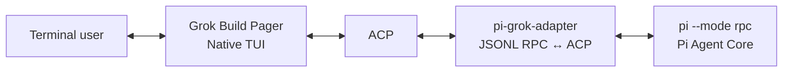

# grok-pi — Pi's agent core in Grok Build's native terminal UI

> **One native terminal UI, one agent core.** Grok Build's production Pager owns every visible terminal interaction; Pi owns the agent, models, tools, extensions, and sessions. Nothing in Pi's source is patched to make it work.

[README.zh-CN](README.zh-CN.md) · [Architecture alignment](NATIVE_GROK_TUI_ALIGNMENT.md) · [Feature matrix](FEATURE_MATRIX.md) · [Verification record](VERIFICATION.md) · [Changelog](CHANGELOG.MD)

---

> **From the author**
>
> This update basically covers all the core Pi-TUI functionality now. The big win for me is having **`ctx.ui.custom` support** — the traditional RPC mode was missing that entirely, so this feels like a major step forward.
>
> I also improved the **Bash integration** for Grok inside Pi (and by the way, I didn't modify any of Pi's original source code at all). Added handy **sub-agent support**, **todo tracking**, **tree navigation**, **resume**, and a few other common utilities.
>
> I've switched to using `grok-pi` as my daily driver now — it's working really well.

---

## What is this?

`grok-pi` runs the [Pi coding agent](https://www.npmjs.com/package/@earendil-works/pi-coding-agent) in JSONL RPC mode behind Grok Build's native Pager. A single headless crate, `pi-grok-adapter`, translates Pi's protocol into ACP so the production Grok terminal can drive Pi directly.



You get Grok's polished production terminal — input, slash completion, Markdown, tool cards, diffs, scrollback, dialogs, and clean terminal lifecycle — while Pi stays the single owner of every agent behavior.

### If you already use Pi

Keep everything you rely on — your models and providers, the agent loop, tools, extensions, skills, prompt templates, sessions, retries, and compaction — **completely unchanged**. Pi is bundled as-is; not one line of its source is modified. On top of that you get Grok Build's production-grade rendering, and — new in this release — **`ctx.ui.custom` finally works over RPC**, so Pi's own interactive selectors and your custom interactive plugins render right inside the native UI.

### If you already use Grok Build

Keep the exact production Pager you know — the renderer, `PromptWidget`, slash dropdown, `QuestionView`, Markdown pipeline, tool/diff cards, and scrollback are byte-for-byte the upstream Grok code. Only the *brain* changes: swap Grok's agent for Pi, and bring Pi's model catalog, extension/skill ecosystem, and branching session tree with you.

## The big win: `ctx.ui.custom` over RPC

Pi's interactive TUI lets extensions and plugins mount their **own** rich components through `ctx.ui.custom(factory)` — the factory receives a TUI handle, theme, keybindings, and a `done` callback, and returns a component that renders lines and handles keystrokes. Pi's native model selector, session selector, provider-login dialogs, and third-party questionnaire plugins (e.g. `rpiv-ask-user-question`) all depend on it.

Under `pi --mode rpc` — the mode `grok-pi` uses — Pi has no local terminal to draw into, so `ctx.ui.custom` was effectively a no-op that always declined. Any capability built on it simply did not exist over RPC.

`grok-pi` restores it **without patching Pi**, via the bundled [`pi-grok-remote-tui`](extensions/pi-grok-remote-tui/index.ts) extension:

1. On `session_start`, it monkey-patches `ctx.ui.custom` so component factories run **in-process** inside the Pi child.
2. It renders each component frame to plain lines (stripping Pi's hardware-cursor marker) and projects them through the existing `ctx.ui.setWidget("remote_tui", …, { placement: "aboveEditor" })` channel, which the adapter surfaces in the native Grok Pager.
3. Keystrokes flow back to the component through a temp keyfile the adapter writes and the extension watches — never through Pi RPC. A real `KeybindingsManager` and a minimal ANSI theme stub make Pi's components behave exactly as they do in interactive Pi.

The `ctx.ui.custom` bridge is **enabled by default** (`PI_GROK_REMOTE_TUI=1`; set `PI_GROK_REMOTE_TUI=0` to disable). Default-on [`pi-grok-auth`](extensions/pi-grok-auth/index.ts) registers bare `/login` and `/logout` (resume-x style) with Pi's native auth components. The opt-in [`pi-grok-native-commands`](extensions/pi-grok-native-commands/index.ts) extension (`PI_GROK_NATIVE_COMMANDS=1`) adds broader experimental selectors (`/pi-model`, `/pi-resume`, `/pi-export`, `/pi-share`, …).

## Highlights in this release

All of the following are delivered by bundled Pi extensions and the headless adapter. **No Pi source is modified** — each capability is either an official Pi extension API or a narrow, declared Grok Pager seam.

| Capability | What you get |
|---|---|
| **`ctx.ui.custom` bridge** | Pi's real interactive components render inside Grok's native UI; enables Pi selectors and custom interactive plugins over RPC |
| **Bash integration** | The bundled Bash extension owns every child process and reuses Pi's `createBashToolDefinition` output/rendering. Native Pager **Send to Background** promotes a running foreground command into the existing task UI **without re-running it**; managed background tasks, `get_task_output` / `wait_tasks` / `kill_task`, process-tree kill, timeouts, and output capping all work |
| **Sub-agents** | Spawn autonomous Pi child `AgentSession`s (`spawn_subagent`) with capability modes (read-only / read-write / execute / all) and profiles (general-purpose / explore / plan), foreground or background. They stream into Grok's native SubagentBlock, Tasks Pane, and child AgentView, support cancel, and replay after resume |
| **Todo tracking** | Pi's `todo` tool snapshots project into ACP `Plan` → Grok's native TodoPane/badge |
| **Tree navigation** | `/tree` opens a native SessionTree modal; navigation bridges Pi's official `ctx.navigateTree` / `ctx.setLabel` (optionally summarizing on jump) |
| **Resume** | `/resume` and Ctrl+S open the native SessionPicker over Pi's on-disk catalog; `grok-pi -c` continues the last session; Welcome prewarms a session to avoid cold-start |
| **Session recap** | `/recap` and auto-away recap generate a display-only "where was I" summary via Pi's model **without mutating session history** |
| **Context view** | `/context` charts real Pi usage (system / tools / AGENTS / skills breakdown) in the native ContextInfoBlock |
| **Pi resource manager** | F2 or `/pi-config` opens a native two-pane manager for Pi extensions, skills, prompts, and themes across global and per-project scopes |
| **Self-update** | `grok-pi update` / `--check` and Welcome Ctrl+U install from `Dwsy/grok-pi` GitHub Releases |

For field-level coverage and intentional omissions, see the [feature matrix](FEATURE_MATRIX.md).

## Core invariants

These rules define the integration and hold for every change:

1. **Grok Pager is the only TUI.** Terminal init/restore, keyboard and mouse input, `PromptWidget`, slash completion, `QuestionView`, Markdown, tool cards, diffs, and scrollback come from the upstream Grok Build codebase.
2. **Pi is the only agent core.** Providers, model selection, the agent loop, tools, extensions, session persistence, retries, and compaction stay in Pi.
3. **The adapter is headless.** It may spawn Pi, correlate JSONL requests, maintain protocol state, and translate Pi JSON ↔ ACP. It must not own a terminal, render widgets, run a keyboard loop, or depend on Ratatui/Crossterm.
4. **Reuse native surfaces; do not imitate them.** A Pi capability is mapped only through an existing Grok surface. If there is no native surface, document the boundary rather than add a private ASCII UI or a duplicate slash-command system.
5. **Never modify Pi to extend it.** When a Pi capability is not exposed over RPC, use the official Pi extension API (as the bundled extensions do). Pi source stays byte-for-byte identical.

## Install a release binary

Every Git tag matching `v*` publishes platform binaries plus installers. The Unix installer detects macOS ARM64 or Linux x64, downloads the matching latest release, and installs `grok-pi` to `~/.local/bin` by default:

```bash
curl -fsSL https://github.com/Dwsy/grok-pi/releases/latest/download/install.sh | sh
```

On Windows x64:

```powershell
irm https://github.com/Dwsy/grok-pi/releases/latest/download/install.ps1 | iex
```

Pin a release or change the install directory with env vars on the same line:

```bash
curl -fsSL https://github.com/Dwsy/grok-pi/releases/download/v0.0.1/install.sh | GROK_PI_VERSION=v0.0.1 sh
GROK_PI_INSTALL_DIR=/opt/grok-pi curl -fsSL https://github.com/Dwsy/grok-pi/releases/latest/download/install.sh | sh
```

```powershell
$env:GROK_PI_VERSION='v0.0.1'; irm https://github.com/Dwsy/grok-pi/releases/download/v0.0.1/install.ps1 | iex
```

The installer reports any required `PATH` update. `grok-pi` needs **Pi >= 0.80.10** and probes the host at startup; missing/too-old installs get OS-aware install hints.

```bash
# macOS / Linux
curl -fsSL https://pi.dev/install.sh | sh

# Windows PowerShell
powershell -c "irm https://pi.dev/install.ps1 | iex"

# npm alternative
npm install --global @earendil-works/pi-coding-agent

grok-pi --pi-bin pi --pi-cwd /path/to/project -- --no-session
```

Keep the binary current with `grok-pi update` (or `grok-pi update --check`); set `GROK_PI_NO_AUTO_UPDATE=1` to disable the background check.

## Requirements

- Rust toolchain **1.92.0** (see the workspace toolchain file)
- Node.js **22.19.0 or later**
- npm
- Python 3 for verification scripts

## Build from source

```bash
./build.sh
```

The build script requires a system-installed `pi` command and builds the `grok-pi` binary only. Set `PI_BIN` to use a different Pi executable:

```bash
PI_BIN=pi ./build.sh
```

## Run

Run with the system-installed `pi` command:

```bash
PI_BIN=pi ./run-local.sh /path/to/project --no-session
```

`run-installed.sh` remains available as an equivalent system-Pi entry point:

```bash
PI_BIN=pi ./run-installed.sh /path/to/project --no-session
```

Arguments after `--` are passed to Pi unchanged (for example `grok-pi -- --model openai/gpt-4o`). Prefer first-class flags when available. Continue Pi's previous session with `grok-pi --continue` or `grok-pi -c`. `grok-pi` also exposes Pi startup options for models (`--provider`, `--model`, `--models`, `--thinking`), sessions (`--session`, `--session-id`, `--session-dir`, `--fork`, `--no-session`, `--name` / `-n`), prompts (`--system-prompt`, repeatable `--append-system-prompt`), resources (`--extension` / `-e`, `--no-extensions` / `-ne`, `--no-skills` / `-ns`, `--no-context-files` / `-nc`), tools (`--tools` / `-t`, `--exclude-tools` / `-xt`, `--no-tools` / `-nt`, `--no-builtin-tools` / `-nbt`), and trust/network (`--approve` / `-a`, `--no-approve` / `-na`, `--offline`). `--resume` is intentionally not exposed; use Welcome or `/resume`. Choose Grok's native rendering mode at startup:

```bash
GROK_PI_MINIMAL=1 PI_BIN=pi ./run-local.sh /path/to/project
GROK_PI_FULLSCREEN=1 PI_BIN=pi ./run-local.sh /path/to/project
GROK_PI_NO_ALT_SCREEN=1 PI_BIN=pi ./run-local.sh /path/to/project
```

Direct invocation is also supported:

```bash
cargo run \
  --manifest-path Cargo.toml \
  -p xai-grok-pager-bin \
  --bin grok-pi \
  -- \
  --pi-bin pi \
  --pi-cwd /path/to/project \
  -- --no-session
```

### Feature toggles

The bundled extensions are enabled through environment variables read at startup:

| Variable | Default | Effect |
|---|---|---|
| `PI_GROK_REMOTE_TUI` | on | `ctx.ui.custom` bridge (set `0` to disable) |
| `PI_GROK_BASH` | on | Grok-owned Bash + Send-to-Background |
| `PI_GROK_NATIVE_COMMANDS` | off | Opt-in `/pi-model`, `/pi-resume`, `/pi-export`, `/pi-share`, … (needs Remote TUI). Bare `/login`/`/logout` are default-on via `pi-grok-auth` |
| `GROK_PI_NO_AUTO_UPDATE` | unset | Disable the background update check |

Pass `--no-extensions` to disable all bundled bridge extensions at once.

## Interaction model

### Command ownership

Grok owns command discovery, completion, and local UI behavior. Pi supplies extension, prompt-template, and skill commands through `get_commands`; the adapter converts them to ACP `AvailableCommand`s and Grok merges them into its native registry. Name collisions are de-duplicated by the Grok registry.

**Grok-native commands wired for Pi**

```text
/exit /help /new /compact /model /effort /rename /resume /tree
/recap /dashboard /notify /queue /pi-config
/copy /find /transcript /export /expand
/multiline /compact-mode /vim-mode /theme /timestamps /timeline
/toggle-mouse-reporting /voice
```

`/new`, `/compact`, `/model`, `/effort`, `/rename`, `/resume`, and `/tree` have Pi-backed behavior; the rest operate on Grok's native UI or local transcript. Grok product commands that depend on cloud services or the Grok session store are intentionally excluded — for example `/history`, `/login`, `/usage`, `/plugins`, `/voice` as a cloud feature, and `/workspace`. The original `/minimal` and `/fullscreen` re-exec commands are excluded because their Grok-specific re-exec path cannot safely retain Pi startup arguments; use the startup environment variables above instead.

### Extension UI mapping

| Pi RPC method | Grok-native surface |
|---|---|
| `notify` | Toast (and a searchable modal via `/notify`) |
| `setStatus` | Keyed sticky status/banner |
| `setWidget` | Persistent native banner projection |
| `setTitle` | Terminal title |
| `set_editor_text` | `PromptWidget` |
| `select` | `QuestionView` option list |
| `confirm` | `QuestionView` Yes/No |
| `input` | `QuestionView` with native freeform `PromptWidget` |
| `editor` | `QuestionView` with native multiline `PromptWidget` |
| `custom` (factory) | **Remote TUI bridge** → component frames projected via `setWidget`, keys via keyfile |

Interactive responses retain Pi's required `{value}`, `{confirmed}`, or `{cancelled:true}` shape. Pi dialog timeouts dismiss their matching Grok dialog, so a timed-out request does not leave a stale modal behind.

### Intentional boundaries

The adapter does not fabricate functionality Pi RPC does not expose or that requires Grok product services. In particular it does not provide raw terminal hooks, synchronous editor-text reads, Pi TUI theme objects, or Grok cloud sessions, login, usage, plugins, or cloud voice. Where `ctx.ui.custom` is now bridged, it renders Pi's real components rather than reimplementing them.

## Repository layout

```text
.
├── crates/codegen/
│   ├── pi-grok-adapter/                     Headless Pi JSONL RPC ↔ ACP bridge
│   └── xai-grok-pager-bin/src/bin/
│       ├── grok-pi.rs                       Composition entry point
│       └── grok_pi/                         CLI, session paths, extension injectors
├── extensions/
│   ├── pi-grok-bash/                        Grok-owned Bash + Send-to-Background
│   ├── pi-grok-subagents/                   Pi child-session lifecycle extension
│   ├── pi-grok-recap/                       Display-only session recap bridge
│   ├── pi-grok-context/                     Context breakdown bridge
│   ├── pi-grok-auth/                        Default-on /login + /logout over Remote TUI
│   ├── pi-grok-native-commands/             Opt-in Pi selectors over ctx.ui.custom
│   └── pi-grok-remote-tui/                  ctx.ui.custom bridge (Remote TUI)
├── pi-main/                                 Optional git submodule → earendil-works/pi
├── docs/                                    Architecture, issues, and change records
├── build.sh                                 Builds Pi and grok-pi
├── run-local.sh                             Runs against system pi (min 0.80.10)
├── run-installed.sh                         Runs against a system-installed Pi
├── verify.sh                                Architecture/protocol/mock/syntax/Cargo checks
└── pi-grok-native-v4.0.0.patch              Patch for a clean Grok Build baseline
```

### Key implementation locations

| Concern | Source of truth |
|---|---|
| Pi RPC types and server behavior | `pi-main/packages/coding-agent/src/modes/rpc/rpc-types.ts`, `rpc-mode.ts` |
| Pi lifecycle and events | `pi-main/packages/coding-agent/src/core/agent-session.ts` |
| Pi extension contract | `pi-main/packages/coding-agent/src/core/extensions/types.ts` |
| Pi process and JSONL correlation | `crates/codegen/pi-grok-adapter/src/pi_rpc.rs` |
| Pi data parsing and models | `crates/codegen/pi-grok-adapter/src/model.rs` |
| ACP agent, event, and UI mappings | `crates/codegen/pi-grok-adapter/src/pi_adapter.rs` |
| Sub-agent bridge projection | `crates/codegen/pi-grok-adapter/src/subagent_projection.rs` |
| Todo → Plan projection | `crates/codegen/pi-grok-adapter/src/todo_bridge.rs` |
| `ctx.ui.custom` bridge | `extensions/pi-grok-remote-tui/index.ts` |
| Grok composition entry point | `crates/codegen/xai-grok-pager-bin/src/bin/grok-pi.rs` |

## Verification

Run the project verification suite:

```bash
./verify.sh
```

The suite checks the architectural boundary, source identity, Pi RPC contracts, mock JSONL interaction, Rust syntax, and — when Cargo is available — `cargo check` plus focused tests.

For a complete native-runtime acceptance, also build and manually verify that:

- the Pager UI, `PromptWidget`, slash dropdown, Markdown, and tool cards are Grok-native;
- Pi dynamic commands appear without duplicate builtins;
- extension UI uses toast/banner/`QuestionView`, not fallback transcript text;
- `ctx.ui.custom` components render through the Remote TUI bridge and take keyboard input;
- model and effort controls update Pi;
- follow-up, steer, Bash (including Send-to-Background), new session, rename, compaction, history replay, and terminal restoration work as expected;
- foreground/background sub-agents appear in the native Subagents group, stream into their child view, finish/fail/cancel correctly, and replay after resume.

The checked-in [verification record](VERIFICATION.md) distinguishes completed static/protocol checks from toolchain-dependent runtime checks. Do not treat a static pass as proof of a successful production build or PTY run.

## Migrating to a newer Grok baseline

Apply the included patch to a clean Grok Build source tree:

```bash
patch --dry-run -p1 < pi-grok-native-v4.0.0.patch
patch -p1 < pi-grok-native-v4.0.0.patch
```

Then place `pi-main` alongside that workspace or configure a system `pi` binary. When the patch conflicts, migrate the narrow seams in this order:

1. Add the headless `pi-grok-adapter` crate.
2. Add the `grok-pi` composition binary and its bundled extensions.
3. Restore the external ACP profile and `run_external` production lifecycle.
4. Gate Grok product services while preserving native UI components.
5. Reconnect Pi notifications and `QuestionView` hints to existing Grok surfaces.
6. Re-run the verification suite and native acceptance checklist.

See [NATIVE_GROK_TUI_ALIGNMENT.md](NATIVE_GROK_TUI_ALIGNMENT.md) for the full architectural map, protocol behavior, source navigation, migration sequence, and troubleshooting guide.

## License and upstream notices

This repository is a fork of Grok Build; Pi source is an optional git submodule (`earendil-works/pi`). Runtime uses system Pi >= 0.80.10. Review the applicable upstream licenses and notices, including [`LICENSE`](LICENSE) and [`THIRD-PARTY-NOTICES`](THIRD-PARTY-NOTICES), before redistribution.
