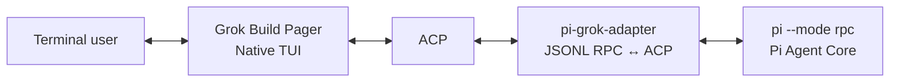

# Grok Build Native TUI × Pi Core

> **One native terminal UI, one agent core.** Grok Build's production Pager owns every visible terminal interaction; Pi owns the agent, models, tools, extensions, and sessions.

[README.zh-CN](README.zh-CN.md) · [Architecture alignment](NATIVE_GROK_TUI_ALIGNMENT.md) · [Feature matrix](FEATURE_MATRIX.md) · [Verification record](VERIFICATION.md)

## Overview

`grok-pi` runs Pi in JSONL RPC mode behind Grok Build's native Pager. The `pi-grok-adapter` crate is deliberately a headless, library-only bridge that translates Pi semantics to ACP; it is **not** another terminal application.



This preserves Grok's production terminal experience—including input, command completion, Markdown, tool cards, diffs, scrollback, dialogs, and terminal lifecycle—while retaining Pi as the single owner of agent behavior.

## Core invariants

These rules define the integration and should hold for every future change:

1. **Grok Pager is the only TUI.** Terminal initialization/restoration, keyboard and mouse input, `PromptWidget`, slash completion, `QuestionView`, Markdown, tool cards, diffs, and scrollback come from the upstream Grok Build codebase.
2. **Pi is the only agent core.** Providers, model selection, the agent loop, tools, extensions, session persistence, retries, and compaction stay in Pi.
3. **The adapter is headless.** It may spawn Pi, correlate JSONL requests, maintain protocol state, and translate Pi JSON ↔ ACP. It must not own a terminal, render widgets, run a keyboard loop, or depend on Ratatui/Crossterm.
4. **Reuse native surfaces; do not imitate them.** A Pi capability is mapped only through an existing Grok surface. If there is no native surface, document the boundary rather than add a private ASCII UI or a duplicate slash-command system.
5. **Protocol facts come from source.** Pi RPC behavior is defined in `pi-main/packages/coding-agent/src/modes/rpc/`; ACP and TUI behavior are defined in the Grok workspace.

## What you get

| Area | Delivery |
|---|---|
| Terminal and rendering | Grok production Pager, minimal/scrollback renderer, Markdown pipeline, tool cards, diffs, scrollback, copy/find/transcript/export |
| Input and commands | Native `PromptWidget`, multiline/Vim support, native slash dropdown, Grok command registry with dynamic Pi command catalog |
| Pi runtime | Pi JSONL RPC process, streaming messages/thoughts, tools, Bash, retry, compaction, model and effort selection, session history |
| Extension UI | Native toast, sticky/persistent banners, terminal title, editor text, and `QuestionView` for select/confirm/input/editor |
| Session flow | Native `/new`, `/rename`, `/compact`, model/effort controls; Pi remains the persistence owner |

For field-level coverage and intentional omissions, see the [feature matrix](FEATURE_MATRIX.md).


## Install a release binary

Every Git tag matching `v*` publishes platform binaries plus installers. The Unix installer detects macOS ARM64 or Linux x64, downloads the matching latest release, and installs `grok-pi` to `~/.local/bin` by default:

```bash
curl -fsSL https://github.com/Dwsy/pi-grok-build/releases/latest/download/install.sh | sh
```

On Windows x64:

```powershell
irm https://github.com/Dwsy/pi-grok-build/releases/latest/download/install.ps1 | iex
```

Pin a release or change the install directory with env vars on the same line:

```bash
curl -fsSL https://github.com/Dwsy/pi-grok-build/releases/download/v0.0.1/install.sh | GROK_PI_VERSION=v0.0.1 sh
GROK_PI_INSTALL_DIR=/opt/grok-pi curl -fsSL https://github.com/Dwsy/pi-grok-build/releases/latest/download/install.sh | sh
```

```powershell
$env:GROK_PI_VERSION='v0.0.1'; irm https://github.com/Dwsy/pi-grok-build/releases/download/v0.0.1/install.ps1 | iex
```

The installer reports any required `PATH` update.

Install Pi, then run `grok-pi`:

```bash
npm install --global @earendil-works/pi-coding-agent
grok-pi --pi-bin pi --pi-cwd /path/to/project -- --no-session
```

## Repository layout

```text
.
├── crates/codegen/
│   ├── pi-grok-adapter/                     Headless Pi JSONL RPC ↔ ACP bridge
│   └── xai-grok-pager-bin/src/bin/
│       └── grok-pi.rs                       Composition entry point
├── pi-main/                                 Bundled, unmodified Pi source
├── docs/                                    Architecture, issues, and change records
├── build.sh                                 Builds Pi and grok-pi
├── run-local.sh                             Runs against bundled Pi
├── run-installed.sh                         Runs against a system-installed Pi
├── verify.sh                                Architecture/protocol/mock/syntax/Cargo checks
└── pi-grok-native-v4.0.0.patch              Patch for a clean Grok Build baseline
```

### Key implementation locations

| Concern | Source of truth |
|---|---|
| Pi RPC types and server behavior | `pi-main/packages/coding-agent/src/modes/rpc/rpc-types.ts`, `rpc-mode.ts` |
| Pi lifecycle and events | `pi-main/packages/coding-agent/src/core/agent-session.ts` |
| Pi extension contract | `pi-main/packages/coding-agent/src/core/extensions/types.ts` |
| Pi process and JSONL correlation | `crates/codegen/pi-grok-adapter/src/pi_rpc.rs` |
| Pi data parsing and models | `crates/codegen/pi-grok-adapter/src/model.rs` |
| ACP agent, event, and UI mappings | `crates/codegen/pi-grok-adapter/src/pi_adapter.rs` |
| Grok composition entry point | `crates/codegen/xai-grok-pager-bin/src/bin/grok-pi.rs` |

## Requirements

- Rust toolchain **1.92.0** (see the workspace toolchain file)
- Node.js **22.19.0 or later**
- npm
- Python 3 for verification scripts


## Build from source

```bash
./build.sh
```

The build script requires a system-installed `pi` command and builds the `grok-pi` binary only. Set `PI_BIN` to use a different Pi executable:

```bash
PI_BIN=pi ./build.sh
```

## Run

Run with the system-installed `pi` command:

```bash
PI_BIN=pi ./run-local.sh /path/to/project --no-session
```

`run-installed.sh` remains available as an equivalent system-Pi entry point:

```bash
PI_BIN=pi ./run-installed.sh /path/to/project --no-session
```

Arguments following `--no-session` are passed to Pi unchanged. Continue Pi's previous session with `grok-pi --continue` or `grok-pi -c`. `grok-pi` also exposes Pi's `--system-prompt`, repeatable `--append-system-prompt`, `--no-skills` (`-ns`), `--no-context-files` (`-nc`), `--extension` (`-e`), `--no-extensions` (`-ne`), `--no-tools` (`-nt`), `--no-session`, and `--name` (`-n`) startup options. Choose Grok's native rendering mode at startup:

```bash
GROK_PI_MINIMAL=1 PI_BIN=pi ./run-local.sh /path/to/project
GROK_PI_FULLSCREEN=1 PI_BIN=pi ./run-local.sh /path/to/project
GROK_PI_NO_ALT_SCREEN=1 PI_BIN=pi ./run-local.sh /path/to/project
```

Direct invocation is also supported:

```bash
cargo run \
  --manifest-path Cargo.toml \
  -p xai-grok-pager-bin \
  --bin grok-pi \
  -- \
  --pi-bin pi \
  --pi-cwd /path/to/project \
  -- --no-session
```

## Interaction model

### Command ownership

Grok owns command discovery, completion, and local UI behavior. Pi supplies extension, prompt-template, and skill commands through `get_commands`; the adapter converts them to ACP `AvailableCommand`s and Grok merges them into its native registry.

**Retained Grok-native commands**

```text
/exit /help /new /compact /model /effort /rename
/copy /find /transcript /export /expand /queue
/multiline /compact-mode /vim-mode /theme /timestamps
/toggle-mouse-reporting
```

`/new`, `/compact`, `/model`, `/effort`, and `/rename` have Pi-backed behavior. The remaining commands operate on Grok's native UI or local transcript. Names that collide with a Grok command do not create a duplicate Pi entry.

Grok product commands that depend on its cloud services or session store are intentionally excluded—for example `/history`, `/login`, `/usage`, `/plugins`, `/voice`, and `/workspace`. The original `/minimal` and `/fullscreen` commands are also excluded because their Grok-specific re-exec path cannot safely retain Pi startup arguments; use the startup environment variables shown above instead.

### Extension UI mapping

| Pi RPC method | Grok-native surface |
|---|---|
| `notify` | Toast |
| `setStatus` | Keyed sticky status/banner |
| `setWidget` | Persistent native banner projection |
| `setTitle` | Terminal title |
| `set_editor_text` | `PromptWidget` |
| `select` | `QuestionView` option list |
| `confirm` | `QuestionView` Yes/No |
| `input` | `QuestionView` with native freeform `PromptWidget` |
| `editor` | `QuestionView` with native multiline `PromptWidget` |

Interactive responses retain Pi's required `{value}`, `{confirmed}`, or `{cancelled:true}` shape. Pi dialog timeouts dismiss their matching Grok dialog, so a timed-out request does not leave a stale modal behind.

### Intentional boundaries

The adapter does not fabricate functionality that Pi RPC does not expose or that requires Grok product services. In particular, it does not provide raw terminal hooks, arbitrary extension component factories, custom Pi header/footer/editor components, synchronous editor-text reads, Pi TUI theme objects, Grok cloud sessions, login, usage, plugins, voice, or subagents.

## Verification

Run the project verification suite:

```bash
./verify.sh
```

The suite checks the architectural boundary, source identity, Pi RPC contracts, mock JSONL interaction, Rust syntax, and—when Cargo is available—`cargo check` plus focused tests.

For a complete native-runtime acceptance, also build and manually verify:

- the Pager UI, `PromptWidget`, slash dropdown, Markdown, and tool cards are Grok-native;
- Pi dynamic commands appear without duplicate builtins;
- Extension UI uses toast/banner/`QuestionView`, not fallback transcript text;
- model and effort controls update Pi;
- follow-up, steer, Bash, new session, rename, compaction, history replay, and terminal restoration work as expected.

The checked-in [verification record](VERIFICATION.md) distinguishes completed static/protocol checks from toolchain-dependent runtime checks. Do not treat a static pass as proof of a successful production build or PTY run.

## Migrating to a newer Grok baseline

Apply the included patch to a clean Grok Build source tree:

```bash
patch --dry-run -p1 < pi-grok-native-v4.0.0.patch
patch -p1 < pi-grok-native-v4.0.0.patch
```

Then place `pi-main` alongside that workspace or configure a system `pi` binary. When the patch conflicts, migrate the narrow seams in this order:

1. Add the headless `pi-grok-adapter` crate.
2. Add the `grok-pi` composition binary.
3. Restore the external ACP profile and `run_external` production lifecycle.
4. Gate Grok product services while preserving native UI components.
5. Reconnect Pi notifications and `QuestionView` hints to existing Grok surfaces.
6. Re-run the verification suite and native acceptance checklist.

See [NATIVE_GROK_TUI_ALIGNMENT.md](NATIVE_GROK_TUI_ALIGNMENT.md) for the full architectural map, protocol behavior, source navigation, migration sequence, and troubleshooting guide.

## License and upstream notices

This repository is a fork of Grok Build and includes bundled Pi source material. Review the applicable upstream licenses and notices, including [`LICENSE`](LICENSE) and [`THIRD-PARTY-NOTICES`](THIRD-PARTY-NOTICES), before redistribution.
