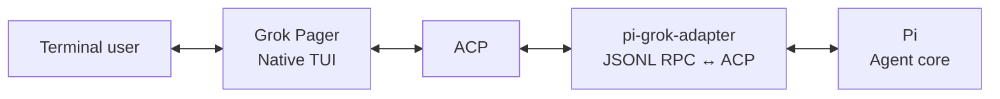

# grok-pi

> Pi agent core in Grok Build's native terminal UI.

[Download latest release](https://github.com/Dwsy/grok-pi/releases/latest) · [中文文档](README.zh-CN.md) · [Feature matrix](FEATURE_MATRIX.md) · [Architecture](NATIVE_GROK_TUI_ALIGNMENT.md) · [Verification](VERIFICATION.md) · [Changelog](CHANGELOG.MD)

`grok-pi` combines Pi's agent runtime with Grok Build's native Pager. Pi remains responsible for models, tools, extensions, sessions, and agent execution. Grok Pager remains the only terminal UI.

## Install

### macOS / Linux

```bash
curl -fsSL https://github.com/Dwsy/grok-pi/releases/latest/download/install.sh | sh
```

### Windows

```powershell
irm https://github.com/Dwsy/grok-pi/releases/latest/download/install.ps1 | iex
```

The installer selects the platform binary and installs `grok-pi` to `~/.local/bin` by default on Unix systems. Set `GROK_PI_INSTALL_DIR` to use another directory.

`grok-pi` requires [Pi](https://www.npmjs.com/package/@earendil-works/pi-coding-agent) **0.80.10 or newer**:

```bash
npm install --global @earendil-works/pi-coding-agent
```

## Start

Run in the current project:

```bash
grok-pi
```

Run in another directory or continue the previous session:

```bash
grok-pi --pi-cwd /path/to/project
grok-pi --continue
```

Useful commands:

```bash
grok-pi --help
grok-pi update --check
grok-pi update
```

## What it provides

| Area | Included |
|---|---|
| Agent runtime | Pi models, providers, tools, extensions, skills, sessions, retries, and compaction |
| Terminal UI | Grok Pager input, slash completion, Markdown, tool cards, diffs, dialogs, and scrollback |
| Interactive extensions | Pi `ctx.ui.custom` components rendered through the native Pager |
| Shell execution | Bash integration, background tasks, output limits, timeouts, and process-tree cleanup |
| Parallel work | Pi sub-agents with foreground/background execution and native task views |
| Session workflow | Resume, tree navigation, labels, recap, context inspection, and session picker |
| Resource management | Native manager for Pi extensions, skills, prompts, and themes |
| Updates | GitHub Releases-based update check and installation |

For field-level behavior and intentional omissions, see the [feature matrix](FEATURE_MATRIX.md).

## Architecture



The integration has three boundaries:

- **Grok Pager** owns terminal lifecycle, input, rendering, dialogs, and visible UI.
- **Pi** owns the agent loop, models, providers, tools, extensions, and sessions.
- **`pi-grok-adapter`** is a headless JSONL RPC ↔ ACP bridge. It does not own a terminal or render a second UI.

Pi source is not modified. Capabilities unavailable in Pi RPC are connected through the official extension API or a declared Pager seam.

## Configuration

Bundled bridge extensions are enabled by default where stable. Experimental native commands are opt-in.

| Variable | Default | Purpose |
|---|---:|---|
| `PI_GROK_REMOTE_TUI` | `1` | Enable Pi `ctx.ui.custom` components |
| `PI_GROK_BASH` | `1` | Enable Grok-owned Bash integration |
| `PI_GROK_NATIVE_COMMANDS` | `0` | Enable experimental `/pi-*` commands |
| `GROK_PI_NO_AUTO_UPDATE` | unset | Disable background update checks |

Use `--no-extensions` to disable bundled bridge extensions. Pi startup options can be passed directly after `--`.

```bash
grok-pi -- --model openai/gpt-4o
```

## Build from source

Requirements: Rust **1.92.0**, Node.js **22.19.0 or newer**, npm, and a system Pi installation.

```bash
./build.sh
PI_BIN=pi ./run-local.sh /path/to/project
```

For direct development invocation:

```bash
cargo run -p xai-grok-pager-bin --bin grok-pi -- --pi-bin pi --pi-cwd /path/to/project
```

Run verification with:

```bash
./verify.sh
```

See [VERIFICATION.md](VERIFICATION.md) for the distinction between static checks and runtime acceptance.

## Documentation

- [Feature matrix](FEATURE_MATRIX.md) — supported behavior and intentional boundaries
- [Architecture alignment](NATIVE_GROK_TUI_ALIGNMENT.md) — component ownership, protocol mapping, and migration guidance
- [Verification record](VERIFICATION.md) — completed checks and known environment blockers
- [Changelog](CHANGELOG.MD) — release history
- [Contributing](CONTRIBUTING.md) — contribution guidelines

## License

See [LICENSE](LICENSE) and [THIRD-PARTY-NOTICES](THIRD-PARTY-NOTICES) for project and upstream notices.
