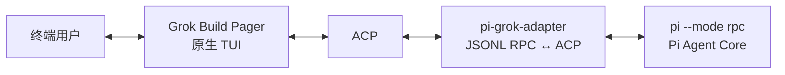

# Grok Build 原生 TUI × Pi Core

> **一套原生终端 UI，一个 Agent Core。** Grok Build 的生产 Pager 负责所有可见终端交互；Pi 负责 Agent、模型、工具、扩展和会话。

[English](README.md) · [架构对齐](NATIVE_GROK_TUI_ALIGNMENT.md) · [功能矩阵](FEATURE_MATRIX.md) · [验证记录](VERIFICATION.md)

## 概览

`grok-pi` 在 Grok Build 的原生 Pager 背后以 JSONL RPC 模式运行 Pi。`pi-grok-adapter` 是一个刻意保持 headless、仅供库使用的桥接 crate，负责将 Pi 语义转换为 ACP；它**不是**第二个终端应用。



这个设计保留了 Grok 的生产级终端体验——输入、命令补全、Markdown、工具卡片、diff、scrollback、对话框和终端生命周期——同时让 Pi 继续作为唯一的 Agent 行为所有者。

## 核心不变量

以下规则定义了本集成，任何后续修改都必须遵守：

1. **Grok Pager 是唯一的 TUI。** 终端初始化/恢复、键盘和鼠标输入、`PromptWidget`、斜杠补全、`QuestionView`、Markdown、工具卡片、diff 和 scrollback 均来自上游 Grok Build 代码。
2. **Pi 是唯一的 Agent Core。** Provider、模型选择、Agent loop、工具、扩展、会话持久化、重试和压缩仍由 Pi 负责。
3. **Adapter 必须保持 headless。** 它可以启动 Pi、关联 JSONL 请求、维护协议状态并转换 Pi JSON ↔ ACP；不得拥有终端、渲染 Widget、运行键盘循环，也不得依赖 Ratatui/Crossterm。
4. **复用原生承载面，不仿造原生承载面。** Pi 能力只能经由已有 Grok UI 映射；没有原生承载面时，应明确记录边界，而不是增加私有字符 UI 或重复的斜杠命令系统。
5. **协议事实以源码为准。** Pi RPC 行为以 `pi-main/packages/coding-agent/src/modes/rpc/` 为准；ACP 和 TUI 行为以 Grok workspace 源码为准。

## 提供的能力

| 范畴 | 交付内容 |
|---|---|
| 终端与渲染 | Grok 生产 Pager、minimal/scrollback renderer、Markdown pipeline、工具卡片、diff、scrollback、copy/find/transcript/export |
| 输入与命令 | 原生 `PromptWidget`、多行/Vim、原生 slash dropdown、Grok command registry 与动态 Pi command catalog |
| Pi 运行时 | Pi JSONL RPC 进程、流式消息/思考、工具、Bash、重试、压缩、模型和 effort 选择、会话历史 |
| Extension UI | 原生 toast、sticky/persistent banner、terminal title、editor text，以及处理 select/confirm/input/editor 的 `QuestionView` |
| 会话流程 | 原生 `/new`、`/rename`、`/compact`、模型/effort 控件；会话持久化仍由 Pi 独占 |

字段级覆盖与刻意不实现的能力请查看[功能矩阵](FEATURE_MATRIX.md)。

## 仓库结构

```text
.
├── crates/codegen/
│   ├── pi-grok-adapter/                     Headless Pi JSONL RPC ↔ ACP bridge
│   └── xai-grok-pager-bin/src/bin/
│       └── grok-pi.rs                       组合入口
├── pi-main/                                 包内、未修改的 Pi 源码
├── docs/                                    架构、Issue 与变更记录
├── build.sh                                 构建 Pi 和 grok-pi
├── run-local.sh                             使用包内 Pi 运行
├── run-installed.sh                         使用系统已安装的 Pi 运行
├── verify.sh                                架构/协议/mock/语法/Cargo 检查
└── pi-grok-native-v4.0.0.patch              面向干净 Grok Build baseline 的补丁
```

### 关键实现位置

| 关注点 | 事实源 |
|---|---|
| Pi RPC 类型与服务端行为 | `pi-main/packages/coding-agent/src/modes/rpc/rpc-types.ts`、`rpc-mode.ts` |
| Pi 生命周期与事件 | `pi-main/packages/coding-agent/src/core/agent-session.ts` |
| Pi extension 契约 | `pi-main/packages/coding-agent/src/core/extensions/types.ts` |
| Pi 进程与 JSONL 关联 | `crates/codegen/pi-grok-adapter/src/pi_rpc.rs` |
| Pi 数据解析与模型 | `crates/codegen/pi-grok-adapter/src/model.rs` |
| ACP Agent、事件与 UI 映射 | `crates/codegen/pi-grok-adapter/src/pi_adapter.rs` |
| Grok 组合入口 | `crates/codegen/xai-grok-pager-bin/src/bin/grok-pi.rs` |

## 环境要求

- Rust toolchain **1.92.0**（见 workspace toolchain 文件）
- Node.js **22.19.0 或更高版本**
- npm
- Python 3（用于验证脚本）

## 安装发布二进制

每个匹配 `v*` 的 Git tag 都会发布平台二进制及安装脚本。Unix 安装脚本会自动识别 macOS ARM64 或 Linux x64，下载对应的最新 release，并默认安装 `grok-pi` 到 `~/.local/bin`：

```bash
curl --fail --location --silent --show-error \
  https://github.com/Dwsy/pi-grok-build/releases/latest/download/install.sh | sh
```

Windows x64 请执行 PowerShell 安装脚本：

```powershell
irm https://github.com/Dwsy/pi-grok-build/releases/latest/download/install.ps1 | iex
```

在任一命令前设置 `GROK_PI_VERSION=vX.Y.Z` 可安装指定版本；设置 `GROK_PI_INSTALL_DIR` 可更改安装目录。脚本会提示所需的 `PATH` 更新。

安装 Pi 后运行 `grok-pi`：

```bash
npm install --global @earendil-works/pi-coding-agent
grok-pi --pi-bin pi --pi-cwd /path/to/project -- --no-session
```

## 从源码构建

```bash
./build.sh
```

构建脚本要求系统已安装 `pi` 命令，并且只构建 `grok-pi` 二进制。可设置 `PI_BIN` 使用其他 Pi 可执行程序：

```bash
PI_BIN=pi ./build.sh
```

## 运行

使用系统安装的 `pi` 命令：

```bash
PI_BIN=pi ./run-local.sh /path/to/project --no-session
```

`run-installed.sh` 保留为等价的系统 Pi 入口：

```bash
PI_BIN=pi ./run-installed.sh /path/to/project --no-session
```

`--no-session` 之后的参数会原样传给 Pi。Grok 的原生渲染模式在启动时选择：

```bash
GROK_PI_MINIMAL=1 PI_BIN=pi ./run-local.sh /path/to/project
GROK_PI_FULLSCREEN=1 PI_BIN=pi ./run-local.sh /path/to/project
GROK_PI_NO_ALT_SCREEN=1 PI_BIN=pi ./run-local.sh /path/to/project
```

也支持直接调用：

```bash
cargo run \
  --manifest-path Cargo.toml \
  -p xai-grok-pager-bin \
  --bin grok-pi \
  -- \
  --pi-bin pi \
  --pi-cwd /path/to/project \
  -- --no-session
```

## 交互模型

### 命令所有权

Grok 负责命令发现、补全和本地 UI 行为。Pi 通过 `get_commands` 提供 extension、prompt template 和 skill 命令；adapter 将它们转换为 ACP `AvailableCommand`，再由 Grok 合并到原生 registry。

**保留的 Grok 原生命令**

```text
/exit /help /new /compact /model /effort /rename
/copy /find /transcript /export /expand /queue
/multiline /compact-mode /vim-mode /theme /timestamps
/toggle-mouse-reporting
```

`/new`、`/compact`、`/model`、`/effort` 和 `/rename` 具有 Pi 后端行为；其余命令仅操作 Grok 原生 UI 或本地 transcript。与 Grok 命令重名时，Pi 不会创建重复入口。

依赖 Grok 云服务或 session store 的产品命令会刻意排除，例如 `/history`、`/login`、`/usage`、`/plugins`、`/voice` 和 `/workspace`。原版 `/minimal`、`/fullscreen` 同样不暴露，因为其 Grok 专属 re-exec 路径无法安全保留 Pi 启动参数；请使用上文的启动环境变量切换。

### Extension UI 映射

| Pi RPC 方法 | Grok 原生承载面 |
|---|---|
| `notify` | Toast |
| `setStatus` | 带 key 的 sticky status/banner |
| `setWidget` | Persistent native banner projection |
| `setTitle` | Terminal title |
| `set_editor_text` | `PromptWidget` |
| `select` | `QuestionView` option list |
| `confirm` | `QuestionView` Yes/No |
| `input` | 使用原生 freeform `PromptWidget` 的 `QuestionView` |
| `editor` | 使用原生 multiline `PromptWidget` 的 `QuestionView` |

交互响应保持 Pi 所需的 `{value}`、`{confirmed}` 或 `{cancelled:true}` 形状。Pi 对话框超时时会撤销匹配的 Grok 对话框，不会在屏幕上留下过期 modal。

### 有意边界

Adapter 不会伪造 Pi RPC 未提供的能力，也不会复刻依赖 Grok 产品服务的功能。具体而言，它不提供 raw terminal hook、任意 extension component factory、自定义 Pi header/footer/editor component、同步 editor-text 读取、Pi TUI theme object，以及 Grok cloud session、login、usage、plugin、voice 或 subagent。

## 验证

执行项目验证套件：

```bash
./verify.sh
```

该套件检查架构边界、源码完整性、Pi RPC 契约、mock JSONL 交互、Rust 语法；在存在 Cargo 时，还会执行 `cargo check` 与聚焦测试。

若要完成完整的原生运行时验收，还应构建并手动确认：

- Pager UI、`PromptWidget`、slash dropdown、Markdown 和工具卡片均为 Grok 原生；
- Pi 动态命令正确出现，且不会与 builtin 重复；
- Extension UI 使用 toast/banner/`QuestionView`，而不是 fallback transcript text；
- 模型和 effort 控件确实更新 Pi；
- follow-up、steer、Bash、新建会话、重命名、压缩、历史回放与终端恢复均符合预期。

已提交的[验证记录](VERIFICATION.md)会区分已完成的静态/协议检查与依赖工具链的运行时检查。静态 PASS 不能当作生产构建或 PTY 运行成功的证据。

## 迁移到更新的 Grok baseline

可将内置补丁应用到干净的 Grok Build 源码树：

```bash
patch --dry-run -p1 < pi-grok-native-v4.0.0.patch
patch -p1 < pi-grok-native-v4.0.0.patch
```

随后将 `pi-main` 放在同级目录，或配置系统 `pi` 二进制。若补丁发生冲突，请按以下顺序迁移窄接缝：

1. 添加 headless `pi-grok-adapter` crate。
2. 添加 `grok-pi` 组合二进制。
3. 恢复 external ACP profile 与 `run_external` 生产生命周期。
4. Gate Grok 产品服务，同时保留原生 UI 组件。
5. 将 Pi notification 和 `QuestionView` hint 重新连接到既有 Grok 承载面。
6. 重新执行验证套件与原生验收清单。

完整的架构地图、协议行为、源码导航、迁移步骤和故障定位见 [NATIVE_GROK_TUI_ALIGNMENT.md](NATIVE_GROK_TUI_ALIGNMENT.md)。

## 许可证与上游声明

本仓库是 Grok Build 的 fork，并包含包内 Pi 源码。再次分发前，请审阅适用的上游许可证与声明，包括 [`LICENSE`](LICENSE) 和 [`THIRD-PARTY-NOTICES`](THIRD-PARTY-NOTICES)。
