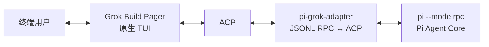

# grok-pi — Grok Build 原生终端 UI 里的 Pi Agent Core

> **一套原生终端 UI，一个 Agent Core。** Grok Build 的生产级 Pager 负责所有可见终端交互；Pi 负责 Agent、模型、工具、扩展和会话。为此**没有改动 Pi 源码的任何一行**。

[English](README.md) · [架构对齐](NATIVE_GROK_TUI_ALIGNMENT.md) · [功能矩阵](FEATURE_MATRIX.md) · [验证记录](VERIFICATION.md) · [更新日志](CHANGELOG.MD)

---

> **来自作者**
>
> 这次更新基本已经覆盖了 Pi-TUI 的全部核心功能。对我来说最大的收获是拿到了 **`ctx.ui.custom` 支持**——传统 RPC 模式完全没有它，所以这感觉像是一次重大突破。
>
> 我还改进了 Grok 里跑 Pi 的 **Bash 集成**（顺便说一句，我完全没有改动 Pi 的任何原始源码）。另外加上了顺手的**子代理支持**、**待办跟踪**、**树导航**、**resume**，以及一些常用的小工具。
>
> 现在我已经把 `grok-pi` 当成日常主力在用了——体验非常好。

---

## 这是什么？

`grok-pi` 让 [Pi coding agent](https://www.npmjs.com/package/@earendil-works/pi-coding-agent) 以 JSONL RPC 模式运行在 Grok Build 原生 Pager 背后。一个 headless 的 crate `pi-grok-adapter` 把 Pi 协议翻译成 ACP，让生产级 Grok 终端直接驱动 Pi。



你获得的是 Grok 打磨过的生产级终端体验——输入、斜杠补全、Markdown、工具卡片、diff、scrollback、对话框以及干净的终端生命周期——同时 Pi 仍然是所有 Agent 行为的唯一所有者。

### 如果你已经在用 Pi

你依赖的一切——模型与 Provider、Agent loop、工具、扩展、skills、prompt template、会话、重试和压缩——**完全保持不变**。Pi 原样内置，源码一行未改。在此之上，你还获得了 Grok Build 的生产级渲染；而且——本次新增——**`ctx.ui.custom` 终于能在 RPC 下工作了**，所以 Pi 自己的交互式选择器以及你的自定义交互插件，都能直接在原生 UI 里渲染。

### 如果你已经在用 Grok Build

你熟悉的那套生产级 Pager 原封不动——renderer、`PromptWidget`、斜杠下拉、`QuestionView`、Markdown pipeline、工具/diff 卡片和 scrollback 都是逐字节一致的上游 Grok 代码。只有*大脑*换了：把 Grok 的 Agent 换成 Pi，把 Pi 的模型目录、扩展/skill 生态、以及可分支的会话树一起带过来。

## 最大的收获：RPC 下的 `ctx.ui.custom`

Pi 的交互式 TUI 允许扩展和插件通过 `ctx.ui.custom(factory)` 挂载**自己**的富组件——factory 会拿到 TUI 句柄、theme、keybindings 和一个 `done` 回调，返回一个能渲染行、能处理按键的组件。Pi 原生的模型选择器、会话选择器、Provider 登录对话框，以及第三方问卷类插件（如 `rpiv-ask-user-question`）都依赖它。

而在 `pi --mode rpc`——也就是 `grok-pi` 使用的模式——下，Pi 没有可绘制的本地终端，所以 `ctx.ui.custom` 实际上是一个永远拒绝的空操作。任何建立在它之上的能力，在 RPC 下根本不存在。

`grok-pi` **在不改 Pi 的前提下**恢复了它，靠的是内置扩展 [`pi-grok-remote-tui`](extensions/pi-grok-remote-tui/index.ts)：

1. 在 `session_start` 时对 `ctx.ui.custom` 打 monkey-patch，让组件 factory 在 Pi 子进程里**进程内**运行。
2. 把每一帧组件渲染成纯文本行（剔除 Pi 的硬件光标标记），再经由已有的 `ctx.ui.setWidget("remote_tui", …, { placement: "aboveEditor" })` 通道投影出去，adapter 会把它呈现到原生 Grok Pager 上。
3. 按键通过一个临时 keyfile 回传给组件——由 adapter 写入、扩展监听——**不走 Pi RPC**。真实的 `KeybindingsManager` 加上极简 ANSI theme stub，让 Pi 组件的行为与交互式 Pi 中完全一致。

`ctx.ui.custom` 桥接**默认开启**（`PI_GROK_REMOTE_TUI=1`；设为 `PI_GROK_REMOTE_TUI=0` 可关闭）。默认开启的 [`pi-grok-auth`](extensions/pi-grok-auth/index.ts) 按 resume-x 风格注册裸命令 `/login`、`/logout`，用 Pi 原生认证组件。可选的 [`pi-grok-native-commands`](extensions/pi-grok-native-commands/index.ts)（`PI_GROK_NATIVE_COMMANDS=1`）才加载更广的实验选择器（`/pi-model`、`/pi-resume`、`/pi-export`、`/pi-share` 等）。

## 本次亮点

以下能力全部由内置 Pi 扩展与 headless adapter 提供。**没有修改 Pi 源码**——每一项要么使用 Pi 官方扩展 API，要么走一条窄且已声明的 Grok Pager 接缝。

| 能力 | 你获得什么 |
|---|---|
| **`ctx.ui.custom` 桥接** | Pi 真实的交互式组件在 Grok 原生 UI 里渲染；让 Pi 选择器和自定义交互插件在 RPC 下可用 |
| **Bash 集成** | 内置 Bash 扩展持有每一个子进程，并复用 Pi 的 `createBashToolDefinition` 输出/渲染语义。Pager 原生的 **Send to Background** 能把正在运行的前台命令提升进已有任务 UI，**无需重跑命令**；受管后台任务、`get_task_output` / `wait_tasks` / `kill_task`、进程组 kill、超时、输出截断都可用 |
| **子代理** | 派生自主的 Pi 子 `AgentSession`（`spawn_subagent`），支持能力模式（read-only / read-write / execute / all）与 profile（general-purpose / explore / plan），可前台或后台。它们会流入 Grok 原生的 SubagentBlock、Tasks Pane 与 child AgentView，支持取消，并在 resume 后回放 |
| **待办跟踪** | Pi `todo` 工具的快照投影为 ACP `Plan` → Grok 原生 TodoPane/角标 |
| **树导航** | `/tree` 打开原生 SessionTree 模态；导航桥接 Pi 官方的 `ctx.navigateTree` / `ctx.setLabel`（跳转时可选摘要） |
| **Resume** | `/resume` 和 Ctrl+S 基于 Pi 磁盘目录打开原生 SessionPicker；`grok-pi -c` 继续上一会话；Welcome 会预热会话以避免冷启动 |
| **会话回顾** | `/recap` 与离开自动回顾会用 Pi 的模型生成"我上次做到哪"的**仅展示**摘要，**不改动会话历史** |
| **上下文视图** | `/context` 在原生 ContextInfoBlock 里绘制真实的 Pi 用量（system / tools / AGENTS / skills 拆分） |
| **Pi 资源管理器** | F2 或 `/pi-config` 打开原生双栏管理器，跨全局与项目作用域管理 Pi 扩展、skills、prompts 和 themes |
| **自更新** | `grok-pi update` / `--check` 与 Welcome Ctrl+U 从 `Dwsy/grok-pi` GitHub Releases 安装 |

字段级覆盖与刻意不实现的能力，请查看[功能矩阵](FEATURE_MATRIX.md)。

## 核心不变量

以下规则定义了本集成，任何后续修改都必须遵守：

1. **Grok Pager 是唯一的 TUI。** 终端初始化/恢复、键盘和鼠标输入、`PromptWidget`、斜杠补全、`QuestionView`、Markdown、工具卡片、diff 和 scrollback 均来自上游 Grok Build 代码。
2. **Pi 是唯一的 Agent Core。** Provider、模型选择、Agent loop、工具、扩展、会话持久化、重试和压缩仍由 Pi 负责。
3. **Adapter 必须保持 headless。** 它可以启动 Pi、关联 JSONL 请求、维护协议状态并转换 Pi JSON ↔ ACP；不得拥有终端、渲染 Widget、运行键盘循环，也不得依赖 Ratatui/Crossterm。
4. **复用原生承载面，不仿造原生承载面。** Pi 能力只能经由已有 Grok UI 映射；没有原生承载面时，应明确记录边界，而不是增加私有字符 UI 或重复的斜杠命令系统。
5. **绝不为扩展而修改 Pi。** 当某个 Pi 能力未经 RPC 暴露时，使用官方 Pi 扩展 API（就像内置扩展那样）。Pi 源码保持逐字节一致。

## 安装发布二进制

每个匹配 `v*` 的 Git tag 都会发布平台二进制及安装脚本。Unix 安装脚本会自动识别 macOS ARM64 或 Linux x64，下载对应的最新 release，并默认安装 `grok-pi` 到 `~/.local/bin`：

```bash
curl -fsSL https://github.com/Dwsy/grok-pi/releases/latest/download/install.sh | sh
```

Windows x64：

```powershell
irm https://github.com/Dwsy/grok-pi/releases/latest/download/install.ps1 | iex
```

同一行固定版本或安装目录：

```bash
curl -fsSL https://github.com/Dwsy/grok-pi/releases/download/v0.0.1/install.sh | GROK_PI_VERSION=v0.0.1 sh
GROK_PI_INSTALL_DIR=/opt/grok-pi curl -fsSL https://github.com/Dwsy/grok-pi/releases/latest/download/install.sh | sh
```

```powershell
$env:GROK_PI_VERSION='v0.0.1'; irm https://github.com/Dwsy/grok-pi/releases/download/v0.0.1/install.ps1 | iex
```

脚本会提示所需的 `PATH` 更新。`grok-pi` 需要系统上有可用的 `pi` 可执行程序——先安装 Pi，再运行 `grok-pi`：

```bash
npm install --global @earendil-works/pi-coding-agent
grok-pi --pi-bin pi --pi-cwd /path/to/project -- --no-session
```

用 `grok-pi update`（或 `grok-pi update --check`）保持二进制最新；设置 `GROK_PI_NO_AUTO_UPDATE=1` 可关闭后台检查。

## 环境要求

- Rust toolchain **1.92.0**（见 workspace toolchain 文件）
- Node.js **22.19.0 或更高版本**
- npm
- Python 3（用于验证脚本）

## 从源码构建

```bash
./build.sh
```

构建脚本要求系统已安装 `pi` 命令，并且只构建 `grok-pi` 二进制。可设置 `PI_BIN` 使用其他 Pi 可执行程序：

```bash
PI_BIN=pi ./build.sh
```

## 运行

使用系统安装的 `pi` 命令：

```bash
PI_BIN=pi ./run-local.sh /path/to/project --no-session
```

`run-installed.sh` 保留为等价的系统 Pi 入口：

```bash
PI_BIN=pi ./run-installed.sh /path/to/project --no-session
```

`--` 之后的参数会原样传给 Pi（例如 `grok-pi -- --model openai/gpt-4o`）；有一等 flag 时优先用一等 flag。使用 `grok-pi --continue` 或 `grok-pi -c` 可继续 Pi 的上一会话。`grok-pi` 还暴露 Pi 的模型（`--provider`、`--model`、`--models`、`--thinking`）、会话（`--session`、`--session-id`、`--session-dir`、`--fork`、`--no-session`、`--name` / `-n`）、提示词（`--system-prompt`、可重复的 `--append-system-prompt`）、资源（`--extension` / `-e`、`--no-extensions` / `-ne`、`--no-skills` / `-ns`、`--no-context-files` / `-nc`）、工具（`--tools` / `-t`、`--exclude-tools` / `-xt`、`--no-tools` / `-nt`、`--no-builtin-tools` / `-nbt`）以及 trust/网络（`--approve` / `-a`、`--no-approve` / `-na`、`--offline`）启动参数。故意不暴露 `--resume`：请用 Welcome 或 `/resume`。Grok 的原生渲染模式在启动时选择：

```bash
GROK_PI_MINIMAL=1 PI_BIN=pi ./run-local.sh /path/to/project
GROK_PI_FULLSCREEN=1 PI_BIN=pi ./run-local.sh /path/to/project
GROK_PI_NO_ALT_SCREEN=1 PI_BIN=pi ./run-local.sh /path/to/project
```

也支持直接调用：

```bash
cargo run \
  --manifest-path Cargo.toml \
  -p xai-grok-pager-bin \
  --bin grok-pi \
  -- \
  --pi-bin pi \
  --pi-cwd /path/to/project \
  -- --no-session
```

### 功能开关

内置扩展通过启动时读取的环境变量启用：

| 变量 | 默认 | 作用 |
|---|---|---|
| `PI_GROK_REMOTE_TUI` | 开 | `ctx.ui.custom` 桥接（设为 `0` 关闭） |
| `PI_GROK_BASH` | 开 | Grok 持有的 Bash + Send-to-Background |
| `PI_GROK_NATIVE_COMMANDS` | 关 | 可选的 `/pi-model`、`/pi-resume`、`/pi-export`、`/pi-share` 等（需 Remote TUI）。裸 `/login`/`/logout` 由 `pi-grok-auth` 默认开启 |
| `GROK_PI_NO_AUTO_UPDATE` | 未设 | 关闭后台更新检查 |

传入 `--no-extensions` 可一次性禁用所有内置桥接扩展。

## 交互模型

### 命令所有权

Grok 负责命令发现、补全和本地 UI 行为。Pi 通过 `get_commands` 提供 extension、prompt template 和 skill 命令；adapter 将它们转换为 ACP `AvailableCommand`，再由 Grok 合并到原生 registry。重名会被 Grok registry 去重。

**已为 Pi 接好的 Grok 原生命令**

```text
/exit /help /new /compact /model /effort /rename /resume /tree
/recap /dashboard /notify /queue /pi-config
/copy /find /transcript /export /expand
/multiline /compact-mode /vim-mode /theme /timestamps /timeline
/toggle-mouse-reporting /voice
```

`/new`、`/compact`、`/model`、`/effort`、`/rename`、`/resume` 和 `/tree` 具有 Pi 后端行为；其余命令仅操作 Grok 原生 UI 或本地 transcript。依赖 Grok 云服务或 Grok session store 的产品命令会刻意排除，例如 `/history`、`/login`、`/usage`、`/plugins`、云端 `/voice` 和 `/workspace`。原版 `/minimal`、`/fullscreen` 的 re-exec 命令同样不暴露，因为其 Grok 专属 re-exec 路径无法安全保留 Pi 启动参数；请使用上文的启动环境变量切换。

### Extension UI 映射

| Pi RPC 方法 | Grok 原生承载面 |
|---|---|
| `notify` | Toast（并可经 `/notify` 打开可搜索 modal） |
| `setStatus` | 带 key 的 sticky status/banner |
| `setWidget` | Persistent native banner projection |
| `setTitle` | Terminal title |
| `set_editor_text` | `PromptWidget` |
| `select` | `QuestionView` option list |
| `confirm` | `QuestionView` Yes/No |
| `input` | 使用原生 freeform `PromptWidget` 的 `QuestionView` |
| `editor` | 使用原生 multiline `PromptWidget` 的 `QuestionView` |
| `custom`（factory） | **Remote TUI 桥接** → 组件帧经 `setWidget` 投影，按键经 keyfile 回传 |

交互响应保持 Pi 所需的 `{value}`、`{confirmed}` 或 `{cancelled:true}` 形状。Pi 对话框超时时会撤销匹配的 Grok 对话框，不会在屏幕上留下过期 modal。

### 有意边界

Adapter 不会伪造 Pi RPC 未提供的能力，也不会复刻依赖 Grok 产品服务的功能。具体而言，它不提供 raw terminal hook、同步 editor-text 读取、Pi TUI theme object，以及 Grok cloud session、login、usage、plugin 或云端 voice。在 `ctx.ui.custom` 已被桥接之处，它渲染的是 Pi 的真实组件，而非重新实现它们。

## 仓库结构

```text
.
├── crates/codegen/
│   ├── pi-grok-adapter/                     Headless Pi JSONL RPC ↔ ACP 桥接
│   └── xai-grok-pager-bin/src/bin/
│       ├── grok-pi.rs                       组合入口
│       └── grok_pi/                         CLI、会话路径、扩展注入器
├── extensions/
│   ├── pi-grok-bash/                        Grok 持有的 Bash + Send-to-Background
│   ├── pi-grok-subagents/                   Pi child-session 生命周期扩展
│   ├── pi-grok-recap/                       仅展示的会话回顾桥接
│   ├── pi-grok-context/                     上下文拆分桥接
│   ├── pi-grok-auth/                        默认开启 /login + /logout（Remote TUI，Pi>=0.80.10）
│   ├── pi-grok-native-commands/             基于 ctx.ui.custom 的可选 Pi 选择器
│   └── pi-grok-remote-tui/                  ctx.ui.custom 桥接（Remote TUI）
├── pi-main/                                 可选 git 子模块 → earendil-works/pi
├── docs/                                    架构、Issue 与变更记录
├── build.sh                                 构建 Pi 和 grok-pi
├── run-local.sh                             使用内置 Pi 运行
├── run-installed.sh                         使用系统已安装的 Pi 运行
├── verify.sh                                架构/协议/mock/语法/Cargo 检查
└── pi-grok-native-v4.0.0.patch              面向干净 Grok Build baseline 的补丁
```

### 关键实现位置

| 关注点 | 事实源 |
|---|---|
| Pi RPC 类型与服务端行为 | `pi-main/packages/coding-agent/src/modes/rpc/rpc-types.ts`、`rpc-mode.ts` |
| Pi 生命周期与事件 | `pi-main/packages/coding-agent/src/core/agent-session.ts` |
| Pi extension 契约 | `pi-main/packages/coding-agent/src/core/extensions/types.ts` |
| Pi 进程与 JSONL 关联 | `crates/codegen/pi-grok-adapter/src/pi_rpc.rs` |
| Pi 数据解析与模型 | `crates/codegen/pi-grok-adapter/src/model.rs` |
| ACP Agent、事件与 UI 映射 | `crates/codegen/pi-grok-adapter/src/pi_adapter.rs` |
| 子代理 bridge 投影 | `crates/codegen/pi-grok-adapter/src/subagent_projection.rs` |
| Todo → Plan 投影 | `crates/codegen/pi-grok-adapter/src/todo_bridge.rs` |
| `ctx.ui.custom` 桥接 | `extensions/pi-grok-remote-tui/index.ts` |
| Grok 组合入口 | `crates/codegen/xai-grok-pager-bin/src/bin/grok-pi.rs` |

## 验证

执行项目验证套件：

```bash
./verify.sh
```

该套件检查架构边界、源码完整性、Pi RPC 契约、mock JSONL 交互、Rust 语法；在存在 Cargo 时，还会执行 `cargo check` 与聚焦测试。

若要完成完整的原生运行时验收，还应构建并手动确认：

- Pager UI、`PromptWidget`、slash dropdown、Markdown 和工具卡片均为 Grok 原生；
- Pi 动态命令正确出现，且不会与 builtin 重复；
- Extension UI 使用 toast/banner/`QuestionView`，而不是 fallback transcript text；
- `ctx.ui.custom` 组件经由 Remote TUI 桥接渲染，并能接收键盘输入；
- 模型和 effort 控件确实更新 Pi；
- follow-up、steer、Bash（含 Send-to-Background）、新建会话、重命名、压缩、历史回放与终端恢复均符合预期；
- 前台/后台子代理进入原生 Subagents 分组、child view，完成/失败/取消与 resume/replay 流程均符合预期。

已提交的[验证记录](VERIFICATION.md)会区分已完成的静态/协议检查与依赖工具链的运行时检查。静态 PASS 不能当作生产构建或 PTY 运行成功的证据。

## 迁移到更新的 Grok baseline

可将内置补丁应用到干净的 Grok Build 源码树：

```bash
patch --dry-run -p1 < pi-grok-native-v4.0.0.patch
patch -p1 < pi-grok-native-v4.0.0.patch
```

随后将 `pi-main` 放在同级目录，或配置系统 `pi` 二进制。若补丁发生冲突，请按以下顺序迁移窄接缝：

1. 添加 headless `pi-grok-adapter` crate。
2. 添加 `grok-pi` 组合二进制及其内置扩展。
3. 恢复 external ACP profile 与 `run_external` 生产生命周期。
4. Gate Grok 产品服务，同时保留原生 UI 组件。
5. 将 Pi notification 和 `QuestionView` hint 重新连接到既有 Grok 承载面。
6. 重新执行验证套件与原生验收清单。

完整的架构地图、协议行为、源码导航、迁移步骤和故障定位见 [NATIVE_GROK_TUI_ALIGNMENT.md](NATIVE_GROK_TUI_ALIGNMENT.md)。

## 许可证与上游声明

本仓库是 Grok Build 的 fork，并包含内置 Pi 源码。再次分发前，请审阅适用的上游许可证与声明，包括 [`LICENSE`](LICENSE) 和 [`THIRD-PARTY-NOTICES`](THIRD-PARTY-NOTICES)。
