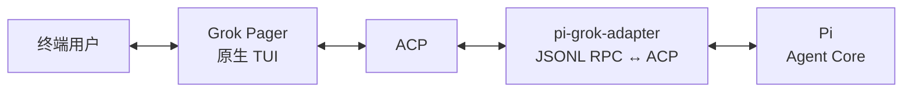

# grok-pi

> 在 Grok Build 原生终端 UI 中运行 Pi Agent Core。

[下载最新版本](https://github.com/Dwsy/grok-pi/releases/latest) · [English](README.md) · [功能矩阵](FEATURE_MATRIX.md) · [架构说明](NATIVE_GROK_TUI_ALIGNMENT.md) · [验证记录](VERIFICATION.md) · [更新日志](CHANGELOG.MD)

`grok-pi` 将 Pi Agent Runtime 接入 Grok Build 原生 Pager。Pi 负责模型、工具、扩展、会话和 Agent 执行；Grok Pager 负责终端 UI，且是唯一的可见终端界面。

## 安装

### macOS / Linux

```bash
curl -fsSL https://github.com/Dwsy/grok-pi/releases/latest/download/install.sh | sh
```

### Windows

```powershell
irm https://github.com/Dwsy/grok-pi/releases/latest/download/install.ps1 | iex
```

安装脚本会自动选择对应平台的二进制文件。Unix 系统默认安装到 `~/.local/bin`，可通过 `GROK_PI_INSTALL_DIR` 指定其他目录。

`grok-pi` 需要 [Pi](https://www.npmjs.com/package/@earendil-works/pi-coding-agent) **0.80.10 或更高版本**：

```bash
npm install --global @earendil-works/pi-coding-agent
```

## 启动

在当前项目中运行：

```bash
grok-pi
```

指定项目目录或继续上一个会话：

```bash
grok-pi --pi-cwd /path/to/project
grok-pi --continue
```

常用命令：

```bash
grok-pi --help
grok-pi update --check
grok-pi update
```

## 能力概览

| 领域 | 能力 |
|---|---|
| Agent Runtime | Pi 模型、Provider、工具、扩展、skills、会话、重试和压缩 |
| 终端 UI | Grok Pager 输入、斜杠补全、Markdown、工具卡片、diff、对话框和 scrollback |
| 交互式扩展 | Pi `ctx.ui.custom` 组件通过原生 Pager 渲染 |
| Shell 执行 | Bash 集成、后台任务、输出限制、超时和进程树清理 |
| 并行工作 | Pi 子代理，支持前台/后台执行和原生任务视图 |
| 会话流程 | Resume、树导航、标签、回顾、上下文查看和会话选择器 |
| 资源管理 | Pi 扩展、skills、prompt 和主题的原生管理器 |
| 更新 | 基于 GitHub Releases 的更新检查与安装 |

详细行为和有意边界见[功能矩阵](FEATURE_MATRIX.md)。

## 架构



集成包含三个边界：

- **Grok Pager** 负责终端生命周期、输入、渲染、对话框和所有可见 UI。
- **Pi** 负责 Agent loop、模型、Provider、工具、扩展和会话。
- **`pi-grok-adapter`** 是 headless JSONL RPC ↔ ACP 桥接层，不拥有终端，也不渲染第二套 UI。

不修改 Pi 源码。Pi RPC 未暴露的能力通过官方扩展 API 或已声明的 Pager 接缝接入。

## 配置

稳定的内置桥接扩展默认启用；实验性原生命令需要显式开启。

| 变量 | 默认值 | 用途 |
|---|---:|---|
| `PI_GROK_REMOTE_TUI` | `1` | 启用 Pi `ctx.ui.custom` 组件 |
| `PI_GROK_BASH` | `1` | 启用 Grok-owned Bash 集成 |
| `PI_GROK_NATIVE_COMMANDS` | `0` | 启用实验性的 `/pi-*` 命令 |
| `GROK_PI_NO_AUTO_UPDATE` | 未设置 | 禁用后台更新检查 |

使用 `--no-extensions` 可关闭所有内置桥接扩展。Pi 启动参数可放在 `--` 之后直接传递：

```bash
grok-pi -- --model openai/gpt-4o
```

## 从源码构建

环境要求：Rust **1.92.0**、Node.js **22.19.0 或更高版本**、npm，以及系统 Pi 安装。

```bash
./build.sh
PI_BIN=pi ./run-local.sh /path/to/project
```

直接运行开发版本：

```bash
cargo run -p xai-grok-pager-bin --bin grok-pi -- --pi-bin pi --pi-cwd /path/to/project
```

运行验证：

```bash
./verify.sh
```

静态检查与运行时验收的区别见[验证记录](VERIFICATION.md)。

## 文档

- [功能矩阵](FEATURE_MATRIX.md) —— 支持的行为与有意边界
- [架构对齐](NATIVE_GROK_TUI_ALIGNMENT.md) —— 组件所有权、协议映射和迁移说明
- [验证记录](VERIFICATION.md) —— 已完成检查与环境阻塞项
- [更新日志](CHANGELOG.MD) —— 版本历史
- [贡献指南](CONTRIBUTING.md) —— 贡献流程

## 许可证

项目及上游声明见 [LICENSE](LICENSE) 和 [THIRD-PARTY-NOTICES](THIRD-PARTY-NOTICES)。
