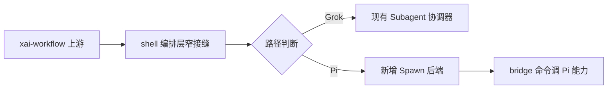

# Upstream Workflow full compat for grok-pi

<!-- pdca:gen -->
> **status:** completed  ·  **phase:** P3  ·  **pdca:** act
> **validation:** passed  ·  **open decisions:** none
> **next:** Optional: handtest deep-research in grok-pi; no blocking work.
<!-- /pdca:gen -->

## Objective

在 **grok-pi（External ACP + Pi Core）** 上完整兼容上游 Workflow：运行 **`xai-workflow` Rhai 引擎** + shell 编排（registry / manager / journal / budget / pause-resume），仅将 **`SpawnAgent` 接到 Pi child session**；Pager 原生 `/workflows` 与 `workflow_updated` 摄入 **零仿造 UI**。

## Architecture (SSOT sketch)

```text
xai-workflow (upstream, pub, no fork of engine)
    ↑ host_tx
shell workflow orchestration (narrow seam: SpawnBackend pluggable)
    ├─ Grok path: existing SubagentEvent::Spawn
    └─ Pi path: bridge → createAgentSession (pi-grok-subagents kernel)
    ↓ workflow_updated
Grok Pager ingest_workflow_update (already exists)
```



## Scope

- **Reuse 100%:** `crates/codegen/xai-workflow`（engine / journal / validate / meta / host protocol）
- **Reuse upstream scripts:** builtin `deep-research.rhai`、`.grok/workflows/*.rhai`、`~/.grok/workflows/*.rhai`
- **Narrow shell seam:** pluggable `WorkflowAgentSpawn` in `host_service`; export External-facing runtime API (no SessionActor required)
- **Pi spawn executor only:** extension bridge (`__pi_workflow_spawn` / cancel); **not** a second Rhai engine
- **Adapter:** host runtime wiring + emit ACP `workflow_updated` + slash/tool forwarding
- **Pager:** prefer zero source change; consume existing `workflow_ingest`

## Out Of Scope

- TS / JS reimplementation of Rhai workflow semantics
- Adapter-owned terminal UI / second workflow dashboard
- Modifying Pi core to invent private RPC
- Grok Goal dual-driver parity in the same first cycle (separate issue)
- Cross-process resume beyond upstream limits (upstream also does not resume after process death)
- Byte-identical `fork_context` with Grok parent session (document best-effort unless D1 reopens)

## Acceptance

- [x] **A1 Engine:** Same `xai_workflow::run_workflow` path runs a real `.rhai` (at least builtin deep-research or a fixture) under grok-pi host
- [x] **A2 Registry:** Project/user/builtin resolve paths match shell registry (same names, same scripts)
- [x] **A3 Spawn:** `SpawnAgent` completes via Pi `createAgentSession`; returns `AgentResult` shape host expects
- [x] **A4 Control:** pause / stop / same-process resume / agent_budget rules match shell manager behavior for the exercised cases
- [x] **A5 UI:** Pager receives `workflow_updated` → WorkflowBlock + `/workflows` show run state (no custom Pi TUI)
- [x] **A6 Grok regression:** Default Grok `SubagentEvent` spawn path still passes existing shell workflow unit tests
- [x] **A7 Docs:** FEATURE_MATRIX + issue record state “upstream engine + Pi spawn backend”; no false “N/A only”
- [x] **A8 Boundaries:** adapter remains headless; no Pi source RPC hacks; no TS workflow engine

## Implementation slices (after D1=split)

| Slice | Deliverable | Verify |
| --- | --- | --- |
| S1 | shell `WorkflowAgentSpawn` trait + Grok default backend | existing workflow tests green |
| S2 | External/standalone runtime export (manager without full SessionActor) | unit test mock spawn |
| S3 | Pi `__pi_workflow_spawn` (+ cancel) bridge extension | plugin static + one live spawn |
| S4 | adapter Runtime + `workflow_updated` + commands | `cargo test -p pi-grok-adapter` + `cargo check -p xai-grok-pager-bin --bin grok-pi` |
| S5 | compat handtest: launch/pause/stop + UI | hand checklist in issue |

## SSOT / Links

| Kind | Path |
| --- | --- |
| This PDCA | `work/20260722-upstream-workflow-pi-compat/` |
| Engine | `crates/codegen/xai-workflow/` |
| Shell orchestration | `crates/codegen/xai-grok-shell/src/session/workflow/` |
| Builtin script | `crates/codegen/xai-grok-shell/src/session/workflows/deep_research.rhai` |
| Pager ingest | `crates/codegen/xai-grok-pager/src/app/acp_handler/workflow_ingest.rs` |
| Subagent pattern | `extensions/pi-grok-subagents/index.ts` |
| Adapter | `crates/codegen/pi-grok-adapter/` |
| Architecture invariants | `AGENTS.md`, `NATIVE_GROK_TUI_ALIGNMENT.md`, `FEATURE_MATRIX.md` |
| Planning issue | `docs/issues/架构/`（待 S0 落盘文件名） |

## Constraints (hard)

1. Grok Pager = only TUI; adapter headless library-only  
2. Pi = only agent core for grok-pi path  
3. Prefer official extension API over Pi source edits  
4. Prefer reusing upstream crates over copy-paste manager  
5. Verify before claiming done (narrowest cargo test/check + read exit code)  
